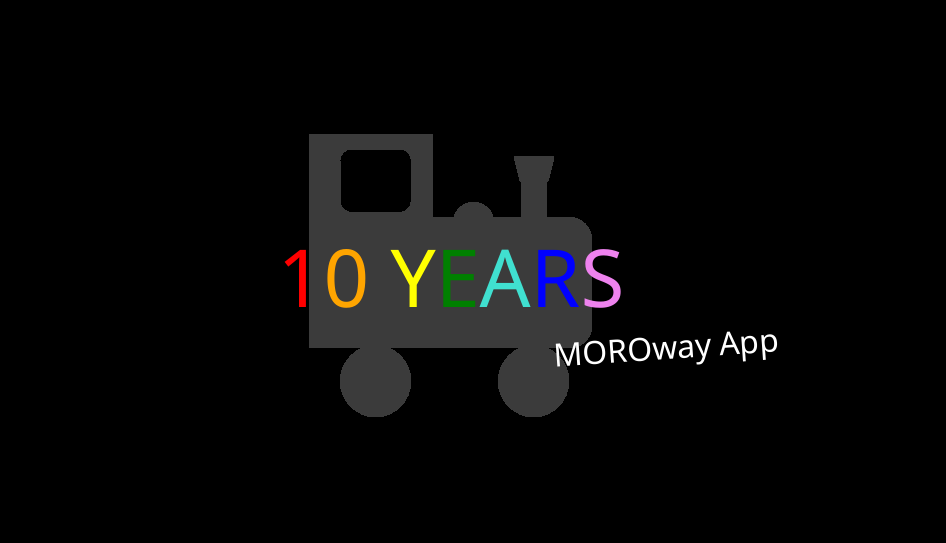

# 10 years of MOROway App…

…celebration website.

## Licenses

You also find the specific license files in each subdirectory.

### LICENSE (ONLY for celebration website and assets)

Apache 2.0 or CC-BY-4.0 (you may choose).

### Included Projects (NOT subject to the above LICENSE)

* docs/archive/5.0+ (MOROway App + Open Source components authors and licenses: See there)
* docs/archive/ruffle (by Mike Welsh, Apache 2.0 or MIT)
* docs/archive/swf (by MOROway, CC BY-NC-SA 3.0 DE)
* docs/NotoSans (by Google, OFL)

## Directory structure

* assets: GIMP files for website images and animation images for the website's gif
* ~~docs: celebration website~~ (moved to [MOROway.github.io](https://github.com/MOROway/MOROway.github.io) repository)
  * ~~docs/index.html: Welcome site~~
  * ~~docs/archive/index.html: Release history site~~
    * ~~docs/archive/swf and docs/archive/ruffle: The first versions were created by Adobe Flash. Ruffle is a flash emulator serving the MOROway App SWF files.~~
    * ~~docs/archive/5.0+: Native HTML5/JS code. Embedded via iframe.~~
  * ~~docs/credits/index.html: Credits site (Overview over the above LICENSES)~~
  * ~~docs/NotoSans: Web font~~
